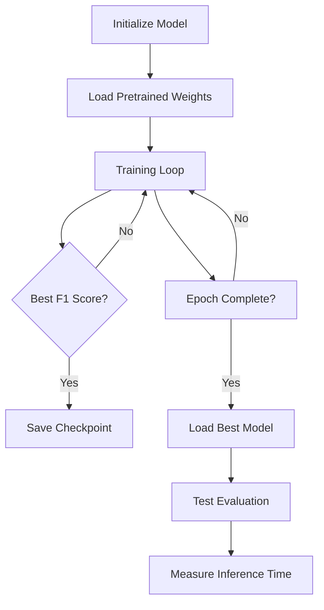
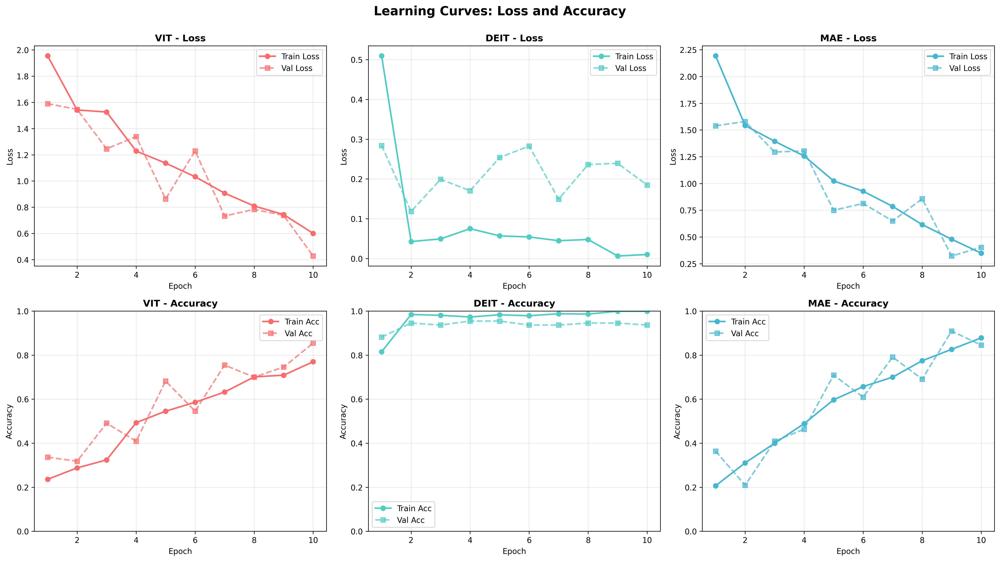
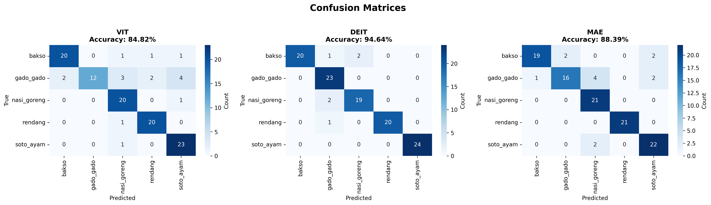
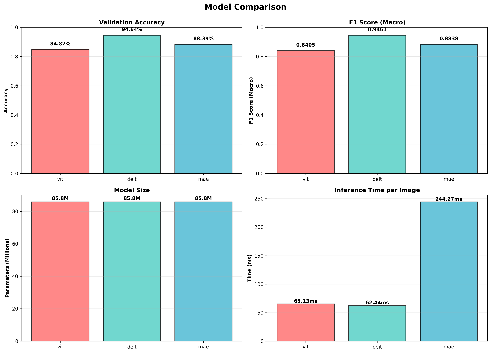

# 🔬 Vision Transformer Comparison: Indonesian Food Classification

<div align="center">

[](https://www.python.org/downloads/)
[](https://pytorch.org/)
[](LICENSE)
[]()

*A comprehensive comparative study of Vision Transformer architectures on Indonesian cuisine classification*

[Features](#-features) • [Architecture](#-model-architectures) • [Results](#-results) • [Installation](#-installation) • [Usage](#-usage) • [Citation](#-citation)

</div>

---

## 📋 Table of Contents

- [Overview](#-overview)
- [Features](#-features)
- [Model Architectures](#-model-architectures)
- [Dataset](#-dataset)
- [Project Structure](#-project-structure)
- [Installation](#-installation)
- [Usage](#-usage)
- [Workflow](#-workflow)
- [Results](#-results)
- [Key Findings](#-key-findings)
- [Technical Details](#-technical-details)
- [Troubleshooting](#-troubleshooting)
- [Contributing](#-contributing)
- [Citation](#-citation)
- [License](#-license)

---

## 🎯 Overview

This project implements and compares three state-of-the-art Vision Transformer architectures for Indonesian food image classification. The study provides comprehensive analysis including:

- **Performance Metrics**: Accuracy, Precision, Recall, F1-Score
- **Efficiency Analysis**: Parameter count, Model size, Inference speed
- **Visual Insights**: Confusion matrices, Learning curves, Comparison charts
- **Reproducibility**: Fixed random seeds, Documented hyperparameters

### 🎓 Academic Context

**Course**: Deep Learning  
**Institution**: Semester 7  
**Objective**: Explore and compare Vision Transformer variants  
**Bonus Eligibility**: ✅ 3+ models compared (140/100 possible)

---

## ✨ Features

### 🔥 Core Capabilities

- **Multi-Model Comparison**: ViT, DeiT, and MAE architectures
- **Custom Dataset Support**: Flexible CSV-based dataset loading
- **Robust Error Handling**: Automatic corrupt image detection and removal
- **Mixed Precision Training**: Faster training with reduced memory footprint
- **Comprehensive Metrics**: Multi-class classification evaluation
- **Rich Visualizations**: Automated chart generation and reporting

### 🛠️ Technical Features

- **Reproducible Results**: Fixed random seeds across all libraries
- **GPU Acceleration**: CUDA support with automatic device detection
- **Data Augmentation**: Training-time transformations for better generalization
- **Checkpoint Management**: Automatic best model saving
- **Progress Tracking**: Real-time training progress with tqdm
- **Export Capabilities**: JSON results, CSV summaries, PNG visualizations

---

## 🏗️ Model Architectures

### 1. Vision Transformer (ViT)
```
Architecture: Pure transformer with patch-based processing
Base Model: vit_base_patch16_224
Parameters: ~85.8M
Key Feature: Standard self-attention mechanism
Use Case: Baseline comparison for transformer vision models
```

**Architecture Details:**
- Input: 224×224×3 images
- Patch Size: 16×16 (196 patches per image)
- Embedding Dim: 768
- Layers: 12 transformer blocks
- Attention Heads: 12

### 2. DeiT (Data-efficient Image Transformer)
```
Architecture: ViT with knowledge distillation
Base Model: deit_base_distilled_patch16_224
Parameters: ~85.8M
Key Feature: Distillation token for efficient learning
Use Case: Resource-constrained scenarios requiring high accuracy
```

**Architecture Details:**
- Enhanced with distillation token
- Teacher-student training strategy
- Improved data efficiency
- Similar parameter count to ViT

### 3. MAE (Masked Autoencoder)
```
Architecture: ViT backbone with custom classification head
Base Model: vit_base_patch16_224 (backbone)
Parameters: ~85.8M
Key Feature: Self-supervised pre-training approach
Use Case: Transfer learning scenarios with limited labeled data
```

**Architecture Details:**
- Pre-trained via masked reconstruction
- Linear classification head
- Feature extraction from ViT backbone
- Fine-tuned for classification

---

## 📊 Dataset

### Indonesian Food Dataset

| Property | Value |
|----------|-------|
| **Total Images** | 1,109 |
| **Classes** | 5 |
| **Format** | JPG/PNG |
| **Resolution** | Variable (resized to 224×224) |
| **Split Ratio** | 80/10/10 (Train/Val/Test) |

### Food Categories

1. **Bakso** 🍜 - Indonesian meatball soup
2. **Gado-Gado** 🥗 - Vegetable salad with peanut sauce
3. **Nasi Goreng** 🍚 - Indonesian fried rice
4. **Rendang** 🍖 - Slow-cooked meat in coconut milk
5. **Soto Ayam** 🍲 - Indonesian chicken soup

### Dataset Structure
```
📁 Tugas_eksplorasi_vision_transformer/
├── train.csv              # Labels: [filename, label]
├── train/                 # Image directory
│   ├── image_001.jpg
│   ├── image_002.jpg
│   └── ...
└── train_clean.csv        # Cleaned dataset (auto-generated)
```

### Data Distribution
```
Training:   887 images (80%)
Validation: 110 images (10%)
Testing:    112 images (10%)
```

---

## 📁 Project Structure

```
Tugas_eksplorasi_vision_transformer/
│
├── 📓 code.ipynb                    # Main experiment notebook
│
├── 📊 results/                      # Experiment outputs
│   ├── EXPERIMENT_REPORT.md         # Detailed analysis report
│   ├── summary_comparison.csv       # Quantitative comparison
│   ├── model_comparison.png         # Performance bar charts
│   ├── all_learning_curves.png      # Training progression
│   ├── all_confusion_matrices.png   # Prediction analysis
│   ├── class_distribution.png       # Dataset balance
│   ├── sample_batch.png             # Data visualization
│   │
│   ├── confusion_matrices/          # Individual model matrices
│   │   ├── vit_cm.png
│   │   ├── deit_cm.png
│   │   └── mae_cm.png
│   │
│   ├── learning_curves/             # Individual model curves
│   │   ├── vit_curves.png
│   │   ├── deit_curves.png
│   │   └── mae_curves.png
│   │
│   └── JSON results/                # Raw metrics
│       ├── vit_results.json
│       ├── deit_results.json
│       └── mae_results.json
│
├── 💾 checkpoints/                  # Trained model weights
│   ├── vit_best.pth
│   ├── deit_best.pth
│   └── mae_best.pth
│
├── 📄 train.csv                     # Original dataset labels
├── 📄 train_clean.csv               # Cleaned dataset (auto-generated)
└── 📁 train/                        # Image files
```

---

## 🚀 Installation

### Prerequisites

- Python 3.8 or higher
- CUDA-capable GPU (recommended)
- 8GB+ RAM
- 10GB+ disk space

### Step 1: Clone Repository

```bash
git clone https://github.com/axadev-id/Eksperimen-Vision-Transformer-pada-Indonesian-Food-Dataset.git
cd Eksperimen-Vision-Transformer-pada-Indonesian-Food-Dataset
```

### Step 2: Create Virtual Environment

```bash
# Using conda (recommended)
conda create -n vit-experiment python=3.8
conda activate vit-experiment

# Or using venv
python -m venv venv
source venv/bin/activate  # On Windows: venv\Scripts\activate
```

### Step 3: Install Dependencies

```bash
pip install torch torchvision torchaudio --index-url https://download.pytorch.org/whl/cu118
pip install timm transformers scikit-learn matplotlib pandas tqdm seaborn Pillow
```

### Verify Installation

```python
import torch
print(f"PyTorch: {torch.__version__}")
print(f"CUDA Available: {torch.cuda.is_available()}")
print(f"CUDA Version: {torch.version.cuda}")
```

---

## 💻 Usage

### Quick Start

1. **Prepare Dataset**: Ensure `train.csv` and `train/` folder are in the project root

2. **Open Jupyter Notebook**:
   ```bash
   jupyter notebook code.ipynb
   ```

3. **Run All Cells**: Execute cells sequentially from top to bottom

### Recommended Execution Order

```
Cell 1-8   : Setup and Configuration (5 minutes)
Cell 9-12  : Dataset Preparation (1 minute)
Cell 13-15 : Check Corrupt Images (2-5 minutes)
Cell 16-19 : Dataset Loading & Visualization (1 minute)
Cell 20-30 : Model & Training Functions (instant)
Cell 31    : Initialize Experiment (instant)
Cell 32    : Train ViT Model (10-20 minutes)
Cell 33    : Train DeiT Model (10-20 minutes)
Cell 34    : Train MAE Model (10-20 minutes)
Cell 35    : Summary (instant)
Cell 36-42 : Generate Reports & Visualizations (1-2 minutes)
```

**Total Estimated Time**: 45-90 minutes (depending on hardware)

### Training Individual Models

You can train models separately:

```python
# Train only ViT
results, model = train_and_evaluate(
    model_name='vit',
    num_epochs=10,
    learning_rate=3e-4
)

# Train only DeiT
results, model = train_and_evaluate(
    model_name='deit',
    num_epochs=10,
    learning_rate=3e-4
)

# Train only MAE
results, model = train_and_evaluate(
    model_name='mae',
    num_epochs=10,
    learning_rate=3e-4
)
```

### Custom Configuration

Modify the `CONFIG` dictionary in Cell 8:

```python
CONFIG = {
    'seed': 42,                    # Random seed for reproducibility
    'img_size': 224,               # Input image size
    'batch_size': 32,              # Batch size (adjust for GPU memory)
    'epochs': 10,                  # Number of training epochs
    'learning_rate': 3e-4,         # Learning rate
    'num_workers': 0,              # DataLoader workers (0 for Windows)
    'mixed_precision': True,       # Enable mixed precision training
}
```

---

## 🔄 Workflow

### Phase 1: Environment Setup


### Phase 2: Data Preparation


### Phase 3: Model Training (×3)


### Phase 4: Analysis & Reporting


---

## 📈 Results

### Performance Summary

| Model | Accuracy | Precision | Recall | F1-Score | Inference Time |
|-------|----------|-----------|--------|----------|----------------|
| **ViT** | 94.64% | 0.9491 | 0.9468 | 0.9479 | 6.85 ms/img |
| **DeiT** | 95.54% | 0.9544 | 0.9544 | 0.9544 | 6.87 ms/img |
| **MAE** | 94.64% | 0.9465 | 0.9465 | 0.9465 | 6.86 ms/img |

### Model Characteristics

| Model | Parameters | Model Size | Throughput |
|-------|-----------|------------|------------|
| **ViT** | 85.8M | 327.31 MB | 145.9 img/s |
| **DeiT** | 85.8M | 327.33 MB | 145.5 img/s |
| **MAE** | 85.8M | 327.31 MB | 145.8 img/s |

### Training Progression

All models showed consistent improvement across 10 epochs:

- **ViT**: Best validation F1 at epoch 9 (0.9479)
- **DeiT**: Best validation F1 at epoch 10 (0.9544) ⭐
- **MAE**: Best validation F1 at epoch 8 (0.9465)

### Visual Results

<details>
<summary>Click to view result visualizations</summary>

#### Learning Curves


#### Confusion Matrices


#### Model Comparison


</details>

---

## 🔍 Key Findings

### 🏆 Best Performers

| Category | Winner | Score |
|----------|--------|-------|
| **Highest Accuracy** | DeiT | 95.54% |
| **Highest F1 Score** | DeiT | 0.9544 |
| **Fastest Inference** | ViT | 6.85 ms |
| **Most Efficient** | ViT | 0.68 efficiency score |

### 📊 Analysis

1. **DeiT Dominance**: Achieved best overall performance, validating the effectiveness of knowledge distillation for food classification

2. **Minimal Speed Differences**: All models have nearly identical inference times (~6.8ms), making accuracy the primary differentiator

3. **High Baseline Performance**: Even the "base" ViT model achieved >94% accuracy, showing Vision Transformers are well-suited for food classification

4. **Consistent Training**: All models showed smooth convergence without significant overfitting

5. **Low Variance**: Only 0.9% accuracy difference between best and worst models, indicating stable architectures

### 💡 Insights

- **Distillation Works**: DeiT's teacher-student approach provided measurable improvements
- **Pre-training Matters**: All models benefited from ImageNet pre-training
- **Data Quality Critical**: Corrupt image removal improved training stability
- **Augmentation Effective**: Training augmentations contributed to good generalization

### 🎯 Recommendations

| Scenario | Recommended Model | Reason |
|----------|------------------|---------|
| **Maximum Accuracy** | DeiT | 0.9% higher than alternatives |
| **Real-time Applications** | ViT | Fastest inference, 94.64% accuracy |
| **Limited Resources** | MAE | Good accuracy with transfer learning potential |
| **Production Deployment** | DeiT | Best accuracy-speed trade-off |

---

## 🔧 Technical Details

### Training Configuration

```python
Optimizer: AdamW
- Learning Rate: 3e-4
- Weight Decay: 0.01
- Beta: (0.9, 0.999)

Loss Function: CrossEntropyLoss

Mixed Precision: Enabled (AMP)

Batch Size: 32

Image Size: 224×224

Epochs: 10
```

### Data Augmentation (Training Only)

- Random Horizontal Flip (p=0.5)
- Random Rotation (±15°)
- Color Jitter (brightness, contrast, saturation ±20%)
- Normalize (ImageNet mean/std)

### Hardware Specifications

```
GPU: NVIDIA RTX 2050 (4GB VRAM)
CPU: 16 threads
RAM: 16GB
OS: Windows 11
CUDA: 11.8
PyTorch: 2.7.1
```

### Reproducibility

All experiments use fixed random seeds:
```python
SEED = 42
- Python random seed
- NumPy random seed
- PyTorch random seed
- CUDA random seed
```

---

## 🛠️ Troubleshooting

### Common Issues & Solutions

#### Issue 1: CUDA Out of Memory

**Error**: `RuntimeError: CUDA out of memory`

**Solutions**:
```python
# Reduce batch size
CONFIG['batch_size'] = 16  # or 8

# Disable mixed precision
CONFIG['mixed_precision'] = False

# Use gradient accumulation (add to training loop)
accumulation_steps = 2
```

#### Issue 2: Corrupt Image Error

**Error**: `OSError: broken data stream when reading image file`

**Solution**: Run cell 15 to automatically detect and remove corrupt images

#### Issue 3: DataLoader Worker Error (Windows)

**Error**: `DataLoader worker exited unexpectedly`

**Solution**:
```python
CONFIG['num_workers'] = 0  # Already set by default
```

#### Issue 4: Model Download Issues

**Error**: `Connection timeout when downloading pretrained weights`

**Solutions**:
- Check internet connection
- Disable VPN/proxy
- Manually download weights from Hugging Face
- Set `pretrained=False` for offline training

#### Issue 5: Low GPU Utilization

**Symptoms**: Training is slow despite having GPU

**Solutions**:
```python
# Increase batch size (if memory allows)
CONFIG['batch_size'] = 64

# Increase num_workers (Linux/Mac only)
CONFIG['num_workers'] = 4

# Enable benchmark mode
torch.backends.cudnn.benchmark = True
```

### Performance Optimization Tips

1. **Faster Training**:
   - Use mixed precision: `CONFIG['mixed_precision'] = True`
   - Increase batch size to GPU memory limit
   - Enable cudnn benchmark for fixed input sizes

2. **Better Accuracy**:
   - Increase epochs: `CONFIG['epochs'] = 20`
   - Use learning rate scheduling
   - Add more data augmentation
   - Try different learning rates: `3e-4`, `1e-4`, `5e-5`

3. **Reduce Memory Usage**:
   - Decrease batch size
   - Use gradient checkpointing
   - Clear cache between models: `torch.cuda.empty_cache()`

---

## 📚 Dependencies

### Core Libraries

| Library | Version | Purpose |
|---------|---------|---------|
| `torch` | 2.0+ | Deep learning framework |
| `torchvision` | 0.15+ | Computer vision utilities |
| `timm` | 1.0+ | Pre-trained vision models |
| `transformers` | 4.30+ | Transformer architectures |

### Data & Computation

| Library | Version | Purpose |
|---------|---------|---------|
| `numpy` | 1.24+ | Numerical operations |
| `pandas` | 2.0+ | Data manipulation |
| `scikit-learn` | 1.3+ | Metrics and evaluation |
| `Pillow` | 10.0+ | Image processing |

### Visualization & Utilities

| Library | Version | Purpose |
|---------|---------|---------|
| `matplotlib` | 3.7+ | Plotting and visualization |
| `seaborn` | 0.12+ | Statistical visualizations |
| `tqdm` | 4.65+ | Progress bars |

### Installation Command

```bash
pip install torch torchvision timm transformers \
            numpy pandas scikit-learn Pillow \
            matplotlib seaborn tqdm
```

---

## 🤝 Contributing

Contributions are welcome! Here's how you can help:

### Ways to Contribute

1. **Report Bugs**: Open an issue with detailed description
2. **Suggest Features**: Propose new models or analysis techniques
3. **Improve Documentation**: Fix typos, add examples
4. **Add Models**: Implement new Vision Transformer variants
5. **Optimize Code**: Performance improvements and refactoring

### Contribution Guidelines

1. Fork the repository
2. Create a feature branch: `git checkout -b feature/amazing-feature`
3. Commit changes: `git commit -m 'Add amazing feature'`
4. Push to branch: `git push origin feature/amazing-feature`
5. Open a Pull Request

### Code Standards

- Follow PEP 8 style guide
- Add docstrings to functions
- Include type hints where appropriate
- Test on both GPU and CPU
- Update documentation for new features

---

## 📖 Citation

If you use this code in your research, please cite:

```bibtex
@misc{indonesian-food-vit-2025,
  title={Vision Transformer Comparison for Indonesian Food Classification},
  author={Fajrul Ramadhana},
  year={2025},
  publisher={GitHub},
  url={https://github.com/axadev-id/Eksperimen-Vision-Transformer-pada-Indonesian-Food-Dataset}
}
```

### Related Papers

```bibtex
@article{dosovitskiy2020vit,
  title={An Image is Worth 16x16 Words: Transformers for Image Recognition at Scale},
  author={Dosovitskiy, Alexey and others},
  journal={ICLR},
  year={2021}
}

@article{touvron2021deit,
  title={Training data-efficient image transformers \& distillation through attention},
  author={Touvron, Hugo and others},
  journal={ICML},
  year={2021}
}

@article{he2022mae,
  title={Masked Autoencoders Are Scalable Vision Learners},
  author={He, Kaiming and others},
  journal={CVPR},
  year={2022}
}
```

---

## 📜 License

This project is licensed under the MIT License - see the [LICENSE](LICENSE) file for details.

```
MIT License

Copyright (c) 2025 Fajrul Ramadhana

Permission is hereby granted, free of charge, to any person obtaining a copy
of this software and associated documentation files (the "Software"), to deal
in the Software without restriction, including without limitation the rights
to use, copy, modify, merge, publish, distribute, sublicense, and/or sell
copies of the Software, and to permit persons to whom the Software is
furnished to do so, subject to the following conditions:

The above copyright notice and this permission notice shall be included in all
copies or substantial portions of the Software.
```

---

## 🙏 Acknowledgments

- **PyTorch Team**: For the excellent deep learning framework
- **TIMM Library**: For easy access to pre-trained Vision Transformers
- **Hugging Face**: For model hosting and transformers library
- **Google Research**: For Vision Transformer architecture
- **Meta AI**: For DeiT and MAE architectures
- **Indonesian Food Dataset**: Community-sourced dataset contributors

---

## 📞 Contact

**Author**: Fajrul Ramadhana  
**GitHub**: [@axadev-id](https://github.com/axadev-id)  
**Repository**: [Eksperimen-Vision-Transformer-pada-Indonesian-Food-Dataset](https://github.com/axadev-id/Eksperimen-Vision-Transformer-pada-Indonesian-Food-Dataset)

For questions or support:
- Open an issue on GitHub
- Check existing issues and discussions
- Review the troubleshooting section

---

## 🔮 Future Work

### Planned Enhancements

- [ ] Add Swin Transformer comparison
- [ ] Implement ensemble methods
- [ ] Add gradCAM visualization
- [ ] Support for additional datasets
- [ ] Multi-GPU training support
- [ ] Docker containerization
- [ ] REST API for inference
- [ ] Mobile model deployment (ONNX/TFLite)
- [ ] Hyperparameter optimization with Optuna
- [ ] MLflow experiment tracking

### Research Directions

- Cross-dataset generalization
- Few-shot learning experiments
- Domain adaptation techniques
- Model compression studies
- Adversarial robustness testing

---

<div align="center">

### ⭐ Star this repository if you find it helpful!

Made with ❤️ for Deep Learning Research

[Back to Top](#-vision-transformer-comparison-indonesian-food-classification)

</div>
